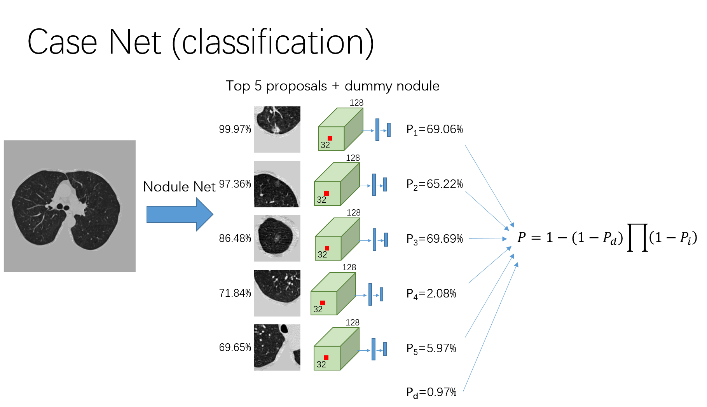

# Dependencies

Ubuntu 14.04, python 2.7, CUDA 8.0, cudnn 5.1, h5py (2.6.0), SimpleITK (0.10.0), numpy (1.11.3), nvidia-ml-py (7.352.0), matplotlib (2.0.0), scikit-image (0.12.3), scipy (0.18.1), pyparsing (2.1.4), pytorch (0.1.10+ac9245a) (anaconda is recommended). The dependencies can be installed using pip install -r requirements.txt

This is my configuration, I am not sure about the compatibility of other versions

# Instructions for running

Testing
1.	unzip the stage 2 data
2.	go to root folder
3.	open config_submit.py, filling in datapath with the stage 2 data path for your machine
4.	python main.py
5.	get the results from prediction.csv

if you have bug about short of memory, set the 'n_worker_preprocessing' in config\_submit.py to a int that is smaller than your core number.

Training
1.	Install all dependencies
2.	Prepare stage1 data, LUNA data, and LUNA segment results (https://luna16.grand-challenge.org/download/), unzip them to separate folders
3.	Go to ./training and open config_training.py
4.	Fill in stage1_data_path, luna_raw, luna_segment  with your path mentioned above
5.	Create luna_data, preprocess_result_path, with tmp folders
6.	Run the training script:
        bash run_training.sh and wait for the finishing of training (it may take several days)
7. A detector model and a classifier model will be outputted to the ./model folder named: classifier.ckpt, detector.ckpt - these files can be used in the concept-to-clinic application

# Utilizing custom data sets

Tools
1. Horos CT scan and annotation software - used to annotate CT scan lesions and export lesion location annotations to csv files.
2. Use dicom files with folder structure format:
 
    Patient ID  
    --->Study ID  
    ----------->SeriesInstanceID  
    ------------------>Dicomfiles(1 to N...) where N is the number of dicom images  

Process: 
1. Download your custom data set and prepare in the above format.
2. Open the config_training.py file and edit the 'custom_data' path to your root folder of patient IDs. 
3. Next it is necesary to prepare the label files for the new data. There is a classification label and a detection label.
    - The classification label example can be found at './classifier/full_label.csv' and should contain the SeriesInstanceID along with the corresponding label (0 for non-cancer, 1 for cancer)
    - The detection label should be placed at the location './detector/labels/custom_annos.csv' with filename matching 'custom_annos_path' field in config_training.py. The label should be the same format as the example file. Each lesion label should contain the seriesID for the dicom image series and the x,y,z center point value in 3D space according to the entire CT scan 3D map (not just within the lung mask). These lesion coordinates can be generated by combining 2D lesion annotations from a series of dicom images. Last is the diameter of the sphere containing the lesion.
4. By default, the detector and classifier training uses kaggle + luna datasets. If you want to use custom dataset, please change the config file 'use_custom_data' which will set the label file names in detector/main.py and classifier/main.py to use the custom_train.npy and custom_val.npy files.
4. The final step is to run the training script using the command: bash run_training.sh
5. A detector model and a classifier model will be outputted to the ./model folder named: classifier.ckpt, detector.ckpt - these files can be used in the concept-to-clinic application

NSCLC-Radiomics Data set
The NSCLC-Radiomics data set contains 422 cases of lung cancer type non-small cell lung cancer. We label these data sets with lesion location information and cancer/non-cancer labels using the software Horos. We then import this data for training in concurrence with the Luna16 and LIDC data sets.
Here is a reference link to download the data sets: http://www.cibl-harvard.org/data

If you do not have 8 GPUs or your the memory of your GPUs is less than 12 GB, decrease the number of -b and -b2 in run\_training.sh, and modify the 'CUDA\_VISIBLE\_DEVICES=0,1,..,n\_your\_gpu'. The time of training is very long (3~4 days with 8 TITANX).

# Brief Introduction to algorithm
Extra Data and labels: we use LUNA16 as extra data, and we manually labeled the locations of nodules in the stage1 training dataset. We also manually washed the label of LUNA16, deleting those that we think irrelavent to cancer. The labels are stored in ./training./detector./labels.

The training involves four steps
1. prepare data

    All data are resized to 1x1x1 mm, the luminance is clipped between -1200 and 600, scaled to 0-255 and converted to uint8. A mask that include the lungs is calculated, luminance of every pixel outside the mask is set to 170. The results will be stored in 'preprocess_result_path' defined in config_training.py along with their corresponding detection labels.

2. training a nodule detector

    in this part, a 3d faster-rcnn is used as the detector. The input size is 128 x 128 x 128, an online hard negative sample mining method is used. The network structure is based on U-net.

3. get all proposals

    The model trained in part 2 was tested on all data, giving all suspicious nodule locations and confidences (proposals)

4. training a cancer classifier

    For each case, 5 proposals are samples according to its confidence, and for each proposal a 96 x 96 x 96 cubes centered at the proposal center is cropped.

    These proposals are fed to the detector and the feature in the last convolutional layer is extracted for each proposal. These features are fed to a fully-connected network and a cancer probability $P_i$ is calculated for each proposal. The cancer probability for this case is calculated as:

    $P = 1-(1-P_d)\Pi(1-P_i)$,

    where the $P_d$ stand for the probability of cancer of a dummy nodule, which is a trainable constant. It account for any possibility that the nodule is missed by the detector or this patient do not have a nodule now. Then the classification loss is calculated as the cross entropy between this $P$ and the label.

    The second loss term is defined as: $-\log(P)\boldsymbol{1}(y_{nod}=1 \& P<0.03)$, which means that if this proposal is manually labeled as nodule and its probability is lower than 3%, this nodule would be forced to have higher cancer probability. Yet the effect of this term has not been carefully studied.

    To prevent overfitting, the network is alternatively trained on detection task and classification task.

The network archetecture is shown below

